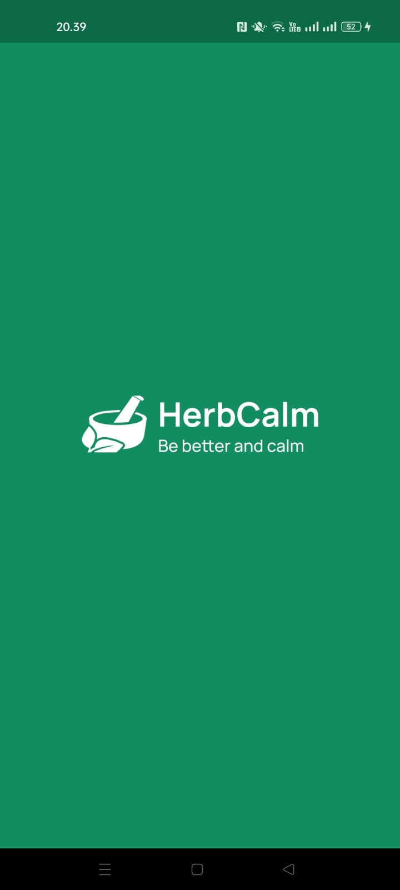
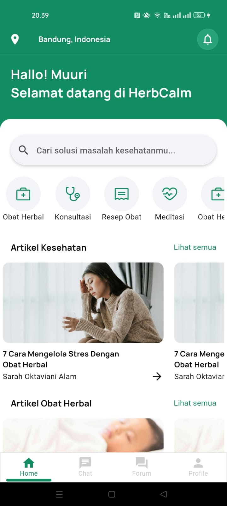
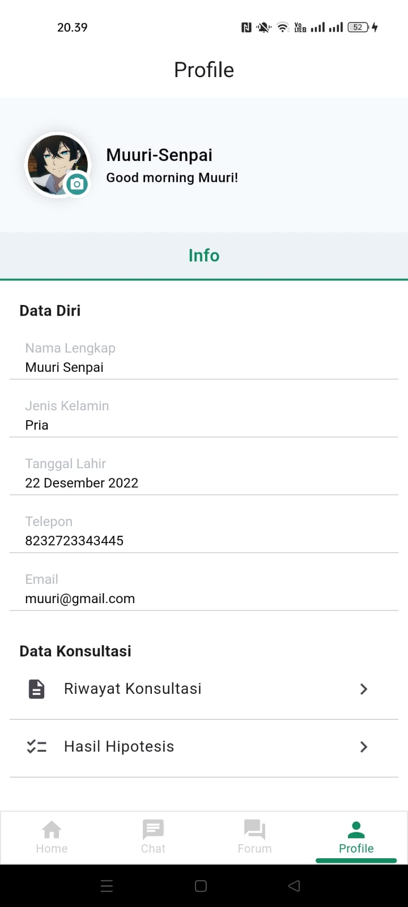

# HerbCalm 🌿

<p align="center">
  
</p>

Aplikasi Kesehatan Herbal adalah teman sehat Anda yang menyediakan sumber informasi terpercaya seputar obat tradisional dan herbal. Dengan fokus pada konsultasi langsung dengan ahli herbal, aplikasi ini membantu pengguna menjalani gaya hidup yang sehat secara alami.

## 🌟 Fitur Utama

- **Login Fleksibel:** 🚪 Nikmati akses terbatas ke forum dan konsultasi tanpa login, tetapi dapatkan pengalaman penuh setelah masuk.

- **Beranda Penuh Rekomendasi:** 🏡 Temukan artikel bermanfaat, jawaban terbaik dari forum, dan rekomendasi ahli langsung dari beranda.

- **Resep Obat Herbal Personal:** 🌱 Dapatkan rekomendasi resep obat herbal yang sesuai dengan keluhan Anda.

- **Pencarian Cepat dan Luas:** 🔍 Temukan apapun yang Anda butuhkan dengan fitur pencarian yang kuat.

- **Konsultasi Online dengan Ahli Herbal:** 💬 Jadikan aplikasi ini sebagai asisten kesehatan pribadi Anda.

- **Kategori Kesehatan:** 📚 Telusuri berbagai kategori seperti obat tradisional, obat herbal terstandarisasi (OHT), dan fitofarmaka.

- **Profil Pribadi yang Dapat Diatur:** 👤 Kelola data pribadi Anda dengan fitur profil yang dapat diedit.


## Running Apps on Local and Installation
- `Running Apps on Lokal`
1. Copy url repository
```bash
 https://github.com/muhammadsadri19/HerbCalm.git
```
2. Clone in your project folder with git or terminal and open project
```bash
 git clone https://github.com/muhammadsadri19/HerbCalm.git
 code .
```
3. Move the branch project from master to dev
```bash
git branch dev
git checkout dev
```
4. Open terminal or git where the project is cloned and install all package
```bash
flutter pub get
```
5. Run Projet
```bash
flutter run
Note : Make sure you're connected to your emulator or device when you want to run the app.
```

- `Install APK on Your Device`
[APK]()

## 📱 UI Aplikasi

<p align="center">
  
  
  
</p>

`Screenshoot BackEnd`
: [LINK DRIVE](https://drive.google.com/drive/folders/1bD97v8_nVrmp0R5qzsXxrx78-CwqQfVj?usp=sharing)

`HerbCalm Pitchdeck`
: [LINK DRIVE](https://drive.google.com/drive/folders/1TJkYSYqZuC1v2zH5oIS-WrxFJWCMwQSn?usp=sharing)

`Mockup Design HerbCalm`
: [LINK DRIVE](https://drive.google.com/drive/folders/1diLqCF9hyAxM3uWIhcQg7Yl2h1R9w8jf?usp=sharing)

## 🤝 Kontributor

`Hacker`
[Muhammad Sadri](https://github.com/muhammadsadri19)

`Hacker`
[Muhammad Zulfikar Ikhsan](https://github.com/MuhammadZulfikarIkhsan8)

`Hipster`
[Mellafesa Rofida](https://github.com/Mellafesa)

`Hustler`
[Casta Garneta](https://github.com/castagh)
   
